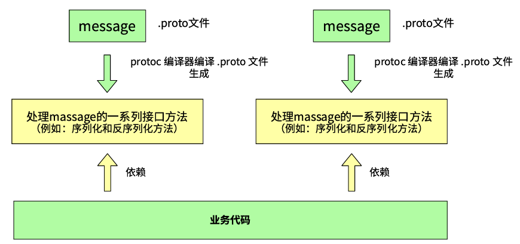
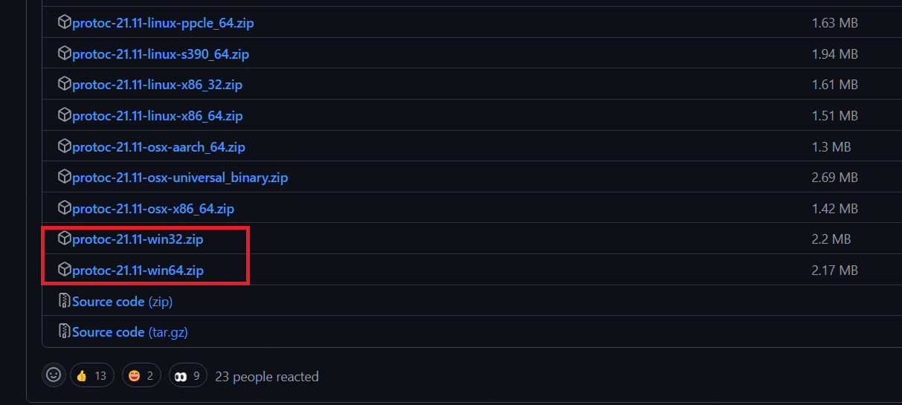
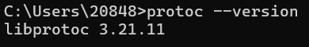
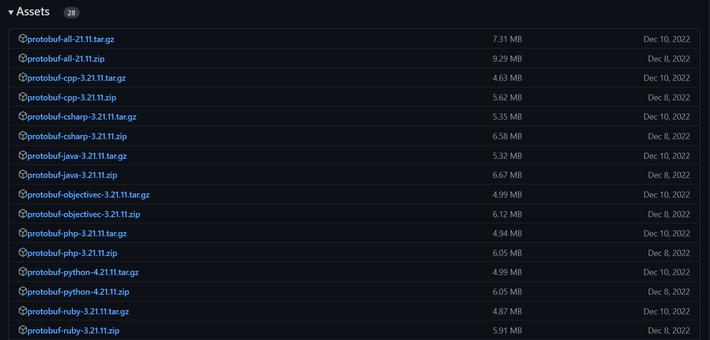
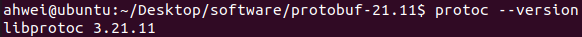

# 1.初识 ProtoBuf

## 一、序列化概念

### 1.序列化和反序列化

- 序列化：把对象转换为字节序列的过程称为对象的序列化
- 反序列化：把字节序列恢复为对象的过程称为对象的反序列化

### 2.什么情况下需要序列化

- 存储数据：把内存中的对象状态保存到一个文件中或者存到数据库中时
- 网络传输：网络直接传输数据，但是无法直接传输对象，所以要在传输前序列化，传输完成后反序列化成对象

### 3.如何实现序列化

xml、json、protobuf

## 二、ProtoBuf 是什么

 ProtoBuf（全称为 Protocol Buffer）是让结构数据序列化的方法，具有以下特点：

- **语言无关、平台无关**：ProtoBuf 支持 Java、C++、Python 等多种语言，支持多个平台。
- **高效**：与 XML 相比，ProtoBuf 更小、更快、更为简单。
- **扩展性、兼容性好**：可以更新数据结构，而不会影响或破坏原有的旧程序。

**使用特点：**



## 三、安装

### 1.Windows环境安装

1. [下载 ProtoBuf 编译器](https://github.com/protocolbuffers/protobuf/releases/tag/v21.11)

   

2. 配置环境变量

   解压后复制 bin 的路径，配置到 path 中去

   

3. 验证配置成功

   打开 cmd，输入

   ```c++
   protoc --version
   ```

   

### 2.Linux 环境安装

1. 安装依赖库：autoconf automake libtool curl make g++ unzip

   - Ubuntu

     ```shell
     sudo apt-get install autoconf automake libtool curl make g++ unzip -y
     ```

   - CentOS

     ```c++
     sudo yum install autoconf automake libtool curl make gcc-c++ unzip
     ```

   

   - 如果要在 C++ 下使用 ProtoBuf，可以选择 cpp.zip
   - 如果要在 Java 下使用 ProtoBuf，可以选择 java.zip
   - 其他语言选择对应的链接即可
   - 希望支持全部语言，选择 all.zip

   我们这里希望支持全部语言，下载这个：

   https://github.com/protocolbuffers/protobuf/releases/download/v21.11/protobuf-all-21.11.zip

   解压并进入：

   ```shell
   unzip protobuf-all-21.11.zip
   cd protobuf-21.11
   ```

2. 安装 ProtoBuf

   ```shell
   # 如果下载的是特定语言的预编译版本，则不需要执行autogen.sh脚本。
   # 否则，第一步执行autogen.sh以生成configure脚本。
   ./autogen.sh 
   
   # 第二步执行configure，选择以下两种方式之一：
   # 方式1：protobuf将默认安装在 /usr/local 目录下，库文件和可执行文件将分散安装。
   ./configure 
   
   # 或者
   
   # 方式2：通过指定 --prefix 选项来修改安装目录，使所有文件都安装在 /usr/local/protobuf 下。
   ./configure --prefix=/usr/local/protobuf
   ```

   再依次执行：

   ```shell
   make				# 15 分钟左右
   make check			# 15 分钟左右
   sudo make install 
   ```

   make check 成功后，就可以执行 sudo make install：

   ```shell
   sudo make install
   ```

   到此，需要你回忆一下在执行configure时，如果当时选择了第一种执行方式，也就是 ./configure ，那么到这就可以正常使用protobuf 了。如果选择了第二种执行方式，即修改了安装 目录，那么还需要在 /etc/profile 中添加一些内容

   ```shell
   sudo vim /etc/profile
   ```

   ```sh
   #(动态库搜索路径) 程序加载运⾏期间查找动态链接库时指定除了系统默认路径之外的其他路径
   export LD_LIBRARY_PATH=$LD_LIBRARY_PATH:/usr/local/protobuf/lib/
   #(静态库搜索路径) 程序编译期间查找动态链接库时指定查找共享库的路径
   export LIBRARY_PATH=$LIBRARY_PATH:/usr/local/protobuf/lib/
   #执⾏程序搜索路径
   export PATH=$PATH:/usr/local/protobuf/bin/
   #c程序头⽂件搜索路径
   export C_INCLUDE_PATH=$C_INCLUDE_PATH:/usr/local/protobuf/include/
   #c++程序头⽂件搜索路径
   export CPLUS_INCLUDE_PATH=$CPLUS_INCLUDE_PATH:/usr/local/protobuf/include/
   #pkg-config 路径
   export PKG_CONFIG_PATH=/usr/local/protobuf/lib/pkgconfig/
   ```

   最后一步，重新执行 /etc/profile 文件：

   ```shell
   source /etc/profile
   ```

3. 检查是否安装成功

   输入以下内容查看版本，有显示说明安装成功：

   ```shell
   protoc --version
   ```

   