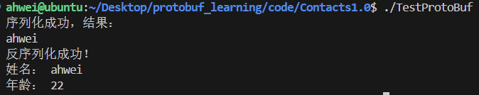

# 2.快速上手——通讯录1.0

本节代码位于：https://github.com/ahhhhwei/Serialization-Scheme/tree/master/Protobuf/code/Contacts1

## 一、任务需求

1. 对一个联系人的信息使用 PB 进行序列化，并将结果打印出来
2. 对序列化后的内容使用 PB 进行反序列化，解析出联系人信息并打印出来
3. 联系人包含以下信息：姓名、年龄

## 二、具体实现

### 1.创建 .proto 文件

**文件规范：**

- 文件命名推荐使用蛇形命名（全小写 + 下划线连接）
- 书写 .proto 文件代码时，应使用2个空格的缩进


**添加注释：**

可以使用 // 或 /* ... */

**指定 proto3 语法：**

```protobuf
syntax = "proto3";
```

**package 声明符：** 

package 是一个可选的声明符，能表示 .proto 文件的命名空间，在项目中要有唯一性。它的作用是为 了避免我们定义的消息出现冲突。

```protobuf
package contacts;
```

**定义消息：**

- 消息（message）：要定义的结构化对象，我们可以给这个结构化对象中定义其对应的属性内容。
- 为什么要定义消息？
  - 在网络传输中，我们需要为传输双方定制协议。定制协议说白了就是定义结构体或者结构化数据，比如，TCP、UDP报文就是结构化的。
  - 再比如将数据持久化存储到数据库时，会将一系列元数据统一用对象组织起来，再进行存储。
- 所以 ProtoBuf 就是以 message 的方式来支持我们定制协议字段，后期帮助我们形成类和方法来使用。在通讯录1.0中我们就需要为联系人定义一个 message。

```protobuf
message 消息类型名 {
	...
}
```

消息类型命名规范：大驼峰

**定义消息字段：**

在 message 中我们可以定义其属性字段，字段定义格式为：

```protobuf
字段类型名 字段名 = 字段唯一编号;
```

- 字段名称命名规范：蛇形命名
- 字段类型分为标量数据类型和特殊类型（如：枚举、其他消息类型）
- 字段唯一编号：用来标识字段，一旦开始使用就不能再改变

**标量数据类型：**

| .proto Type | Notes                                                        | C++ Type |
| ----------- | ------------------------------------------------------------ | -------- |
| double      |                                                              | double   |
| float       |                                                              | float    |
| int32       | 使用变长编码 $^{[1]}$。负数的编码效率较低——若字段可能为负值，应使用 sint32 代替。 | int32    |
| int64       | 使用变长编码 $^{[1]}$。负数的编码效率较低——若字段可能为负值，应使用 sint64 代替。 | int64    |
| uint32      | 使用变长编码 $^{[1]}$。                                      | uint32   |
| uint64      | 使用变长编码 $^{[1]}$。                                      | uint64   |
| sint32      | 使用变长编码 $^{[1]}$。符号整型。负值的编码效率高于常规的 int32 类型。 | int32    |
| sint64      | 使用变长编码 $^{[1]}$。符号整型。负值的编码效率高于常规的 int64 类型。 | int64    |
| fixed32     | 定长 4 字节。若值常大于  $2^{28}$ 则会比 uint32 更高效。     | uint32   |
| fixed64     | 定长 8 字节。若值常大于  $2^{56}$ 则会比 uint64 更高效。     | uint64   |
| sfixed32    | 定长 4 字节。                                                | int32    |
| sfixed64    | 定长 8 字节。                                                | int64    |
| bool        |                                                              | bool     |
| string      | 字符串类型。                                                 | string   |
| bytes       | 字节数组类型。                                               | string   |

> [1]变长编码是指：经过 protobuf 编码后，原本4字节或8字节的数可能会变成其他字节数。

**contact.proto：**

```protobuf
// 首行：语法指定行
syntax = "proto3";

// 命名空间
package contacts;

// 定义联系人message
message PeopleInfo {
  string name = 1;  // 姓名
  int32 age = 2;    // 年龄  
}
```

### 2.编译 contact.proto 文件

```shell
protoc  [--proto_path=IMPORT_PATH]  --cpp_out=DST_DIR  path/to/file.proto
```

- `protoc`：Protocol Buffer 的命令行编译工具。
- `--proto_path=IMPORT_PATH` 或 `-I IMPORT_PATH`：指定被编译的 `.proto` 文件所在目录，可多次指定。如果不指定该参数，则在当前目录进行搜索。当某个 `.proto` 文件 `import` 其他 `.proto` 文件或需要编译的 `.proto` 文件不在当前目录下时，这时就要用 `-I` 来指定搜索目录。
- `--cpp_out=DST_DIR`：指编译后的文件为 C++ 文件，并且定义编译后生成文件的目标路径。
- `path/to/file.proto`：要编译的 `.proto` 文件。

```shell
 protoc  --cpp_out=.  contact.proto
```

编译后会生成两个文件 contact.pb.h  contact.pb.cc  

- 对于每个 message，都会生成一个对应的消息类
- 在消息类中，编译器为每个字段提供了获取和设置方法，以及其他能够操作字段的方法

**contact.pb.h 部分代码展示：**

```c++
class PeopleInfo
    final : public ::PROTOBUF_NAMESPACE_ID::Message
{
public:
    using ::PROTOBUF_NAMESPACE_ID::Message::CopyFrom;
    void CopyFrom(const PeopleInfo &from);
    using ::PROTOBUF_NAMESPACE_ID::Message::MergeFrom;
    void MergeFrom(const PeopleInfo &from)
    {
        PeopleInfo::MergeImpl(*this, from);
    }
    static ::PROTOBUF_NAMESPACE_ID::StringPiece FullMessageName()
    {
        return "PeopleInfo";
    }
    // string name = 1;
    void clear_name();
    const std::string &name() const;
    template <typename ArgT0 = const std::string &, typename... ArgT>
    void set_name(ArgT0 &&arg0, ArgT... args);
    std::string *mutable_name();
    PROTOBUF_NODISCARD std::string *release_name();
    void set_allocated_name(std::string *name);
    // int32 age = 2;
    void clear_age();
    int32_t age() const;
    void set_age(int32_t value);
};
```

- 每个字段都有设置和获取的方法，get 方法的名称与小写字段完全相同，set 方法以 set_ 开头

- 每个字段都有一个 clear_ 方法，可以将字段重新设置回 empty 状态

- 序列化和反序列化的方法在消息类的父类 MessageLite 中，提供了读写消息实例的方法，包括序列化方法和反序列化方法

  ```c++
  class MessageLite
  {
  public:
      // 序列化：
      bool SerializeToOstream(ostream *output) const; // 将序列化后数据写⼊⽂件流
      bool SerializeToArray(void *data, int size) const;
      bool SerializeToString(string *output) const;
  
      // 反序列化：
      bool ParseFromIstream(istream *input); // 从流中读取数据，再进⾏反序列化动作
      bool ParseFromArray(const void* data, int size);
      bool ParseFromString(const string& data);
  };
  ```

  注意：

  - 序列化的结果为二进制字节序列，而非文本格式
  - 以上三红序列化的方法没有本质上的区别，知识序列化后输出的格式不同，可以供不同应用场景使用
  - 序列化的 API 函数均为 const 成员函数，因为序列化不会改变类对象的内容，而是将序列化的结果保存到函数参数指定的地址中
  - [详细 message API](https://protobuf.dev/reference/cpp/api-docs/google.protobuf.message/#Message)

### 3.序列化和反序列化的使用

创建主函数测试代码 main.cc，实现：

- 对一个联系人的信息使用 PB 进行序列化，并将结果打印出来
- 对序列化后端内容使用 PB 进行反序列化，解析出联系人信息并打印出来

main.cc：

```cpp
#include "contact.pb.h"
 
int main() { 
    std::string people_str; 

    {
        // 对一个联系人的信息使用 PB 进行序列化，并将结果打印出来。
        contacts::PeopleInfo people; 
        people.set_name("ahwei"); 
        people.set_age(22); 
        if (!people.SerializeToString(&people_str)) { 
            std::cerr << "序列化联系人失败！" << std::endl; 
            return -1;
        }
        std::cout << "序列化成功，结果：" << people_str << std::endl; 
    }
    
    {
        // 对序列化后的内容使用 PB 进行反序列化，解析出联系人信息并打印出来。
        contacts::PeopleInfo people; 
        if (!people.ParseFromString(people_str)) { 
            std::cerr << "反序列化联系人失败！" << std::endl; 
            return -1;
        } 
        std::cout << "反序列化成功！" << std::endl
                  << "姓名： " << people.name() << std::endl
                  << "年龄： " << people.age() << std::endl;
    }

    return 0;
} 
```

编译 main.cc：

```shell
g++ main.cc contact.pb.cc -o TestProtoBuf -std=c++11 -lprotobuf
```

执行可执行程序：

```shell
./TestProtoBuf
```



相对于 xml 和 JSON 来说，因为被编码成二进制，破解成本增大，ProtoBuf 编码相对安全的。
