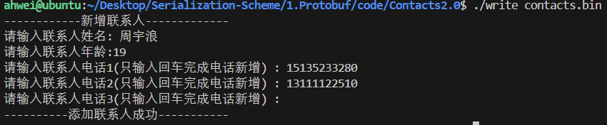
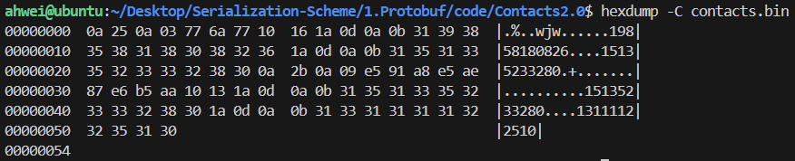
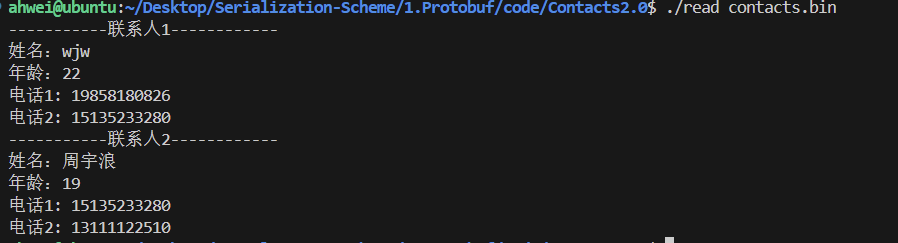
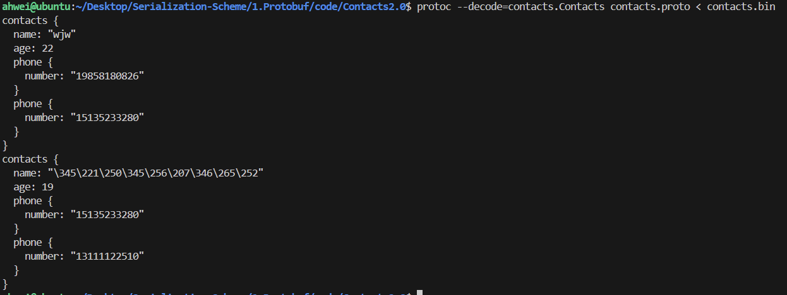

# 3.通讯录2.0

本节代码位于：https://github.com/ahhhhwei/Serialization-Scheme/tree/master/Protobuf/code/Contacts2/Contact2.0

升级需求：

- 不再打印联系人的序列化结果，而是将通讯录序列化后写入文件中
- 从文件中将通讯录解析出来，并进行打印
- 新增联系人属性，共包括：姓名、年龄、电话信息

## 一、字段规则

消息的字段可以用下面几种规则来修饰：

- singular：消息中可以包含该字段零次或一次（不超过一次）。在 proto3 语法中，字段默认使用该规则
- repeated：消息中可以包含该字段任意多次（包含零次），其中重复值的顺序会被保留。可以理解为定义了一个数组

我们在 PeopleInfo 消息中新增 phone_numbers 字段，表示一个联系人有多个号码，可以将其设置为 repeated，写法如下：

```protobuf
syntax = "proto3";
package contacts;

message PeopleInfo {
  string name = 1;            
  int32 age = 2;  
  repeated string phone_numbers = 3;
}
```

## 二、消息类型的定义与使用

### 1.定义

在单个 .proto 文件中可以定义多个消息体，且支持定义嵌套类型的消息（任意多层）。每个消息体中的字段编号可以与外面重复

- 嵌套写法

  ```protobuf
  syntax = "proto3";
  package contacts;
  
  message PeopleInfo {
    string name = 1;            
    int32 age = 2;  
    message Phone {
      string number = 1;
    }
  }
  ```

- 非嵌套写法

  ```protobuf
  syntax = "proto3";
  package contacts;
  
  message Phone {
    string number = 1;
  }
    
  message PeopleInfo {
    string name = 1;            
    int32 age = 2;   
  }
  ```

### 2.使用

#### 2.1 消息类型可作为字段类型使用

```protobuf
syntax = "proto3";
package contacts;

// 联系人
message PeopleInfo {
  string name = 1;                
  int32 age = 2;                
  message Phone {
    string number = 1;  
  }
  repeated Phone phone = 3; 
}
```

#### 2.2 可导入其他 .proto 文件的消息并使用

例如 Phone 消息定义在 phone.proto 文件中：

```protobuf
syntax = "proto3";
package phone;

message Phone {
  string number = 1;
}
```

contacts.proto 中的 PeopleInfo 使用 Phone 消息：

```protobuf
syntax = "proto3";
package contacts;

// 导入 contacts.proto 文件
import "contacts.proto";

message PeopleInfo {
  string name = 1;                
  int32 age = 2;
  
  // 引入的文件使用了package，使用消息时，要用 ‘命名空间.消息类型’ 格式
  repeated phone.Phone phone = 3; 
}
```

> 在 proto3 文件中可以导入 proto2 消息类型并使用它们，反之亦然

### 3.创建通讯录2.0版本

contacts.proto：

```protobuf
syntax = "proto3";
package contacts;

// 联系人
message PeopleInfo {
  string name = 1;          // 姓名          
  int32 age = 2;            // 年龄

  message Phone {
    string number = 1;      // 电话号码
  }
  repeated Phone phone = 3; //电话
}

// 通讯录
message Contacts {
    repeated PeopleInfo contacts = 1;
}
```

编译：

```shell
protoc --cpp_out=. contacts.proto
```

在生成的代码中：

- 每个字段都有一个 clear_ 方法，可以将字段重新设置回 empty 状态
- 每个字段都有设置和获取的方法，获取方法的方法名称与小写字段名称完全相同。但是如果是消息类型的字段，其设置方法为 mutable_ 方法，返回值为消息类型的指针，这类方法会为我们开辟好空间，可以直接对这块空间的内容进行修改
- 对于使用 repeated 修饰的字段，也就是数组类型，pb为我们提供了 add_ 方法来新增一个值，并且提供了 _size 方法来判断数组存放元素的个数

#### 3.1 通讯录2.0的写入实现

write.cc

```c++
#include <iostream>
#include <fstream>
#include "contacts.pb.h"
using namespace std;
using namespace contacts;

/**
  *
  新增联系人
  */
void AddPeopleInfo(PeopleInfo* people_info_ptr)
{
    cout << "------------新增联系人-------------" << endl;
    cout << "请输入联系人姓名: ";
    string name;
    getline(cin, name);
    people_info_ptr->set_name(name);
    cout << "请输入联系人年龄:";
    int age;
    cin >> age;
    people_info_ptr->set_age(age);
    cin.ignore(256, '\n');
    for (int i = 1;; i++)
    {
        cout << "请输入联系人电话" << i << "(只输入回车完成电话新增) : ";
        string number;
        getline(cin, number);
        if (number.empty())
        {
            break;
        }
        PeopleInfo_Phone *phone = people_info_ptr->add_phone();
        phone->set_number(number);
    }
    cout << "----------添加联系人成功-----------" << endl;
}

int main(int argc, char *argv[])
{
    // GOOGLE_PROTOBUF_VERIFY_VERSION 宏:验证没有意外链接到与编译的头文件不兼容的库版本。如果检测到版本不匹配，程序将中止。注意，每个.pb.cc 文件在启动时都会自动调用此宏。在使用 C++ Protocol Buffer库之前执行此宏是一种很好的做法，但不是绝对必要的。

    GOOGLE_PROTOBUF_VERIFY_VERSION;
    if (argc != 2)
    {
        cerr << "Usage:  " << argv[0] << " CONTACTS_FILE" << endl;
        return -1;
    }
    Contacts contacts;
    // 先读取已存在的contacts
    fstream input(argv[1], ios::in | ios::binary);
    if (!input)
    {
        cout << argv[1] << ": File was not found.  Creating a new file." << endl;
    }
    else if (!contacts.ParseFromIstream(&input))
    {
        cerr << "Failed to parse contacts." << endl;
        input.close();
        return -1;
    }
    // 新增一个联系人

    AddPeopleInfo(contacts.add_contacts());
    // 向磁盘文件写入新的 contacts
    fstream output(argv[1], ios::out | ios::trunc | ios::binary);
    if (!contacts.SerializeToOstream(&output))
    {
        cerr << "Failed to write contacts." << endl;
        input.close();
        output.close();
        return -1;
    }
    input.close();
    output.close();
    // 在程序结束时调用 ShutdownProtobufLibrary()，为了删除Protocol Buffer库分配的所有全局对象。对于大多数程序来说这是不必要的，因为该过程无论如何都要退出，并且操作系统将负责回收其所有内存。但是，如果你使用了内存泄漏检查程序，该程序需要释放每个最后对象，或者你正在编写可以由单个进程多次加载和卸载的库，那么你可能希望强制使用Protocol Buffers来清理所有内容。

    google::protobuf::ShutdownProtobufLibrary();
    return 0;
}
```

编译并运行：

makefile 文件如下：

```makefile
write:write.cc contacts.pb.cc
	g++ -o $@ $^ -std=c++11 -lprotobuf

.PHONY:clean
clean:
	rm -f write
```



查看二进制文件：

```shell
hexdump -C contacts.bin
```



hexdump：是 Linux 下的一个二进制文件查看工具，它可以将二进制文件转换为 ASCII、八进制、十进制、十六进制查看

-C：表示每个字节显示为16进制和相应的ASCII字符

#### 3.2 通讯录2.0的读取实现

read.cc

```c++
#include <iostream>
#include <fstream>
#include "contacts.pb.h"
using namespace std;
using namespace contacts;
/**
 *
 打印联系人列表
 */
void PrintfContacts(const Contacts &contacts)
{
    for (int i = 0; i < contacts.contacts_size(); ++i)
    {
        const PeopleInfo &people = contacts.contacts(i);
        cout << "-----------联系人" << i + 1 << "------------" << endl;
        cout << "姓名：" << people.name() << endl;
        cout << "年龄：" << people.age() << endl;
        int j = 1;
        for (const PeopleInfo_Phone &phone : people.phone())
        {
            cout << "电话" << j++ << ": " << phone.number() << endl;
        }
    }
}
int main(int argc, char *argv[])
{
    GOOGLE_PROTOBUF_VERIFY_VERSION;
    if (argc != 2)
    {
        cerr << "Usage:  " << argv[0] << "CONTACTS_FILE" << endl;
        return -1;
    }
    // 以二进制方式读取contacts
    Contacts contacts;
    fstream input(argv[1], ios::in | ios::binary);
    if (!contacts.ParseFromIstream(&input))
    {
        cerr << "Failed to parse contacts." << endl;
        input.close();
        return -1;
    }
    // 打印contacts
    PrintfContacts(contacts);
    input.close();
    google::protobuf::ShutdownProtobufLibrary();
    return 0;
}
```

编译并运行：

makefile 文件如下：

```makefile
all:write read
write:write.cc contacts.pb.cc
	g++ -o $@ $^ -std=c++11 -lprotobuf
read:read.cc contacts.pb.cc
	g++ -o $@ $^ -std=c++11 -lprotobuf
.PHONY:clean
clean:
	rm -f write read
```



**另一种验证方法 decode：**

我们可以用 protoc -h 命令查看ProtoBuf 为我们提供的所有命令 option。其中一个为 decode，表示从标准输入中读取给定类型的二进制消息，并将其以文本格式写入标准输出。消息类型必须在 .proto 文件中导入或定义。

