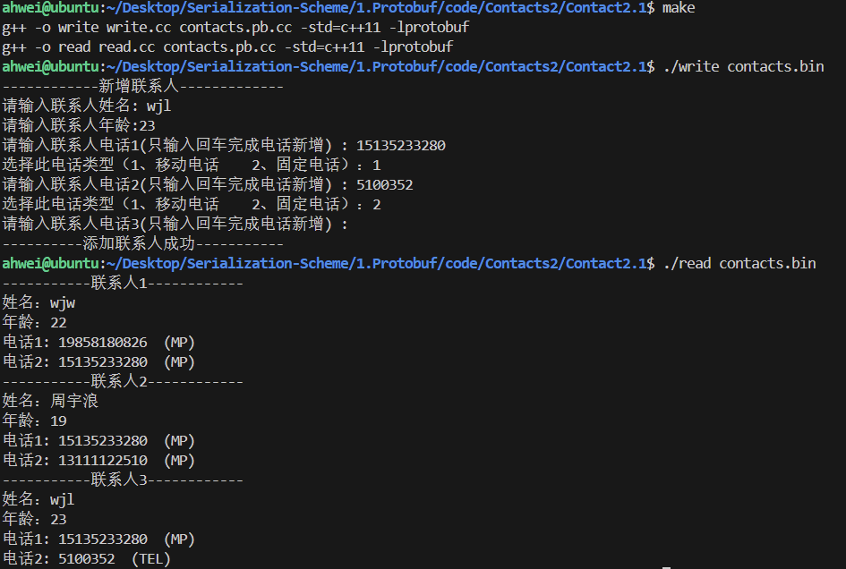

# 4.通讯录2.1

本节代码位于：https://github.com/ahhhhwei/Serialization-Scheme/tree/master/1.Protobuf/code/Contacts2/Contact2.1

升级需求：电话类型，用枚举类型表示

## 一、enum 类型

### 1.书写规范

- 枚举类型名称： 

  使用驼峰命名法，首字母大写。例如：MyEnum

- 常量值名称：

  全大写字母，多个字母之间用 `_` 连接。例如：ENUM_CONST = 0;

### 2.定义

定义一个名为 PhoneType 的枚举类型：

```protobuf
enum PhoneEnum {
	MP = 0;  // 移动电话
	TEL = 0; //固定电话
}
```

要注意枚举类型的定义有以下几种规则：

1. 0值常量必须存在，且要作为第一个元素。这时为了 proto2 的语义兼容：第一个元素作为默认值，且值为0
2. 枚举类型可以在消息外定义，也可以在消息体内定义（嵌套）
3. 枚举的常量值在32位整数的范围内。负值无效不建议使用（与编码规则有关）

### 3.注意事项

1. 同级（同层）的枚举类型，各个枚举类型中的常量不能重名

   ```protobuf
   syntax = "proto3";
   package contacts;
   
   enum PhoneType {
       MP = 0;  
       TEL = 1;  
   }
   
   enum PhoneTypeCopy {
       MP = 0;  
   }
   ```

   

2. 单个 .proto 文件下，最外层枚举类型和嵌套枚举类型不算同级

   ```protobuf
   syntax = "proto3";
   package contacts;
   
   enum PhoneType {
       MP = 0;  
   }
   
   message Phone {
       string number = 1;   
       enum PhoneType {
           MP = 0;
           TEL = 1; 
       }
   }
   ```

3. 多个 .proto 文件下，若一个文件引入了其他文件，每个文件都未声明 package，每个 proto 文件中的枚举类型都在最外层，算同级

4. 多个 .proto 文件下，若一个文件引入了其他文件，每个文件都声明了 package，不算同级

   contacts.proto：

   ```protobuf
   syntax = "proto3";
   import "phone.proto";
   package contacts;
   
   enum PhoneType {
       MP = 0;
       TEL = 1; 
   }
   
   message Phone {
       phone.PhoneType phone = 3;
   }
   ```

   phone.proto：

   ```protobuf
   syntax = "proto3";
   
   package phone;
   enum PhoneType {
       MP = 0;  
   }
   ```

## 二、升级通讯录至2.1版本

更新 contacts.proto，新增枚举字段：

```protobuf
syntax = "proto3";
package contacts;

// 联系⼈
message PeopleInfo {
  string name = 1;          // 姓名          
  int32 age = 2;            // 年龄

  message Phone {
    string number = 1;      // 电话号码
    enum PhoneType {
        MP = 0;  // 移动电话
        TEL = 1; // 固定电话
    }
    PhoneType type = 2; // 类型
  }
  repeated Phone phone = 3; //电话
}

// 通讯录
message Contacts {
    repeated PeopleInfo contacts = 1;
}
```

编译：

```shell
protoc --cpp_out=. contacts.proto
```

生成的代码中：

- 对于在 .proto 文件中定义的枚举类型，编译生成的代码中会含有与之对应的枚举类型、校验枚举类型值是否有效的方法 _IsValid、以及获取枚举值名称的方法 _Name
- 对于使用了枚举类型的字段，包含设置和获取字段的方法，以及清空字段的方法 clear_

更新 write.cc：

```c++
#include <iostream>
#include <fstream>
#include "contacts.pb.h"
using namespace std;
using namespace contacts;

/**
 * 新增联系人信息。
 */
void AddPeopleInfo(PeopleInfo *people_info_ptr)
{
    cout << "------------新增联系人-------------" << endl;
    cout << "请输入联系人姓名: ";
    string name;
    getline(cin, name);
    people_info_ptr->set_name(name);
    cout << "请输入联系人年龄:";
    int age;
    cin >> age;
    people_info_ptr->set_age(age);
    cin.ignore(256, '\n');
    for (int i = 1;; i++)
    {
        cout << "请输入联系人电话" << i << "(仅输入回车完成电话添加) : ";
        string number;
        getline(cin, number);
        if (number.empty())
        {
            break;
        }
        PeopleInfo_Phone *phone = people_info_ptr->add_phone();
        phone->set_number(number);
        cout << "选择此电话类型（1、移动电话    2、固定电话）：";
        int type;
        cin >> type;
        cin.ignore(256, '\n');
        switch (type)
        {
        case 1:
            phone->set_type(PeopleInfo_Phone_PhoneType::PeopleInfo_Phone_PhoneType_MP);
            break;
        case 2:
            phone->set_type(PeopleInfo_Phone_PhoneType::PeopleInfo_Phone_PhoneType_TEL);
            break;
        default:
            cout << "非法选择，使用默认值！" << endl;
            break;
        }
    }
    cout << "----------添加联系人成功-----------" << endl;
}

int main(int argc, char *argv[])
{
    // GOOGLE_PROTOBUF_VERIFY_VERSION 宏用于验证是否意外链接到了与编译的头文件不兼容的库版本。如果检测到版本不匹配，程序将终止。注意，每个.pb.cc 文件在启动时都会自动调用此宏。在使用 C++ Protocol Buffer库之前执行此宏是一个很好的做法，但不是绝对必要的。

    GOOGLE_PROTOBUF_VERIFY_VERSION;
    if (argc != 2)
    {
        cerr << "用法:  " << argv[0] << " CONTACTS_FILE" << endl;
        return -1;
    }
    Contacts contacts;
    // 尝试读取已存在的联系人信息
    fstream input(argv[1], ios::in | ios::binary);
    if (!input)
    {
        cout << argv[1] << ": 文件未找到。创建一个新文件。" << endl;
    }
    else if (!contacts.ParseFromIstream(&input))
    {
        cerr << "解析联系人信息失败。" << endl;
        input.close();
        return -1;
    }
    // 添加一个新的联系人

    AddPeopleInfo(contacts.add_contacts());
    // 将更新后的联系人信息写入磁盘文件
    fstream output(argv[1], ios::out | ios::trunc | ios::binary);
    if (!contacts.SerializeToOstream(&output))
    {
        cerr << "写入联系人信息失败。" << endl;
        input.close();
        output.close();
        return -1;
    }
    input.close();
    output.close();
    // 在程序结束时调用 ShutdownProtobufLibrary()，以释放Protocol Buffer库分配的所有全局对象。对于大多数程序来说这是不必要的，因为进程无论如何都要退出，并且操作系统会负责回收所有内存。但是，如果你使用了内存泄漏检查工具，或者编写的是可以由单个进程多次加载和卸载的库，那么你可能希望强制Protocol Buffers清理所有内容。

    google::protobuf::ShutdownProtobufLibrary();
    return 0;
}
```

更新 read.cc：

```c++
#include <iostream>
#include <fstream>
#include "contacts.pb.h"
using namespace std;
using namespace contacts;

/**
 * 打印联系人列表。
 */
void PrintfContacts(const Contacts &contacts)
{
    for (int i = 0; i < contacts.contacts_size(); ++i)
    {
        const PeopleInfo &people = contacts.contacts(i);
        cout << "-----------联系人" << i + 1 << "------------" << endl;
        cout << "姓名：" << people.name() << endl;
        cout << "年龄：" << people.age() << endl;
        int j = 1;
        for (const PeopleInfo_Phone &phone : people.phone())
        {
            cout << "电话" << j++ << ": " << phone.number();
            cout << "  (" << phone.PhoneType_Name(phone.type()) << ")" << endl;
        }
    }
}

int main(int argc, char *argv[])
{
    // GOOGLE_PROTOBUF_VERIFY_VERSION 宏用于验证是否意外链接到了与编译的头文件不兼容的库版本。如果检测到版本不匹配，程序将终止。注意，每个.pb.cc 文件在启动时都会自动调用此宏。在使用 C++ Protocol Buffer库之前执行此宏是一个很好的做法，但不是绝对必要的。

    GOOGLE_PROTOBUF_VERIFY_VERSION;
    if (argc != 2)
    {
        cerr << "用法:  " << argv[0] << " CONTACTS_FILE" << endl;
        return -1;
    }

    // 以二进制方式读取联系人信息
    Contacts contacts;
    fstream input(argv[1], ios::in | ios::binary);
    if (!contacts.ParseFromIstream(&input))
    {
        cerr << "解析联系人信息失败。" << endl;
        input.close();
        return -1;
    }

    // 打印联系人信息
    PrintfContacts(contacts);

    input.close();

    // 在程序结束时调用 ShutdownProtobufLibrary()，以释放Protocol Buffer库分配的所有全局对象。对于大多数程序来说这是不必要的，因为进程无论如何都要退出，并且操作系统会负责回收所有内存。但是，如果你使用了内存泄漏检查工具，或者编写的是可以由单个进程多次加载和卸载的库，那么你可能希望强制Protocol Buffers清理所有内容。

    google::protobuf::ShutdownProtobufLibrary();
    return 0;
}
```

编译并运行：



前面那些联系人打印出 MP 是因为未设置该字段，导致用了枚举的第一个元素作为默认值