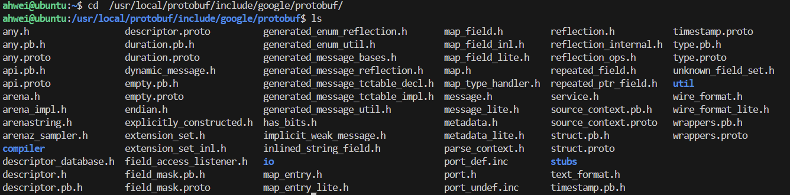
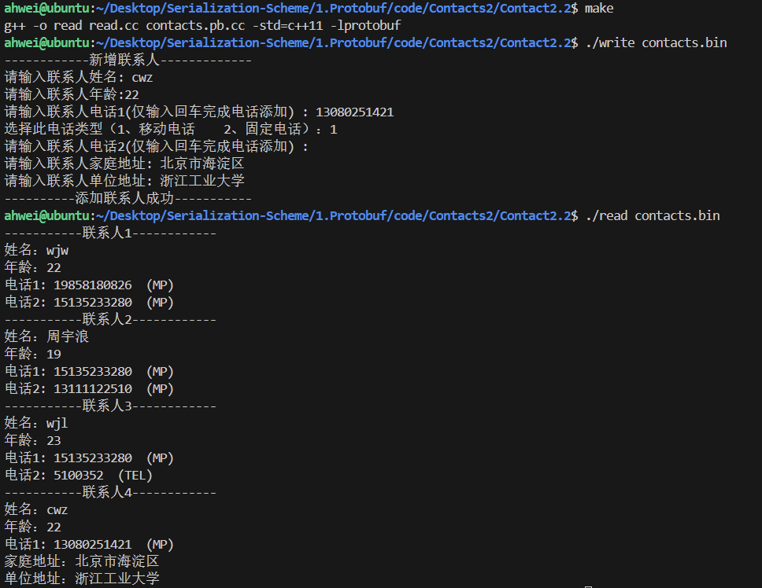

# 5.通讯录2.2

本节代码位于：https://github.com/ahhhhwei/Serialization-Scheme/tree/master/Protobuf/code/Contacts2/Contact2.2

## 一、Any 类型

字段还可以声明为 Any 类型，可以理解为泛型类型。使用时可以在 Any 中存储任意消息类型。Any 类型的子u但也可用 repeated 来修饰。

Any 类型是 google 已经帮我们定义好的类型，在安装 ProtoBuf 时，其中的 include 目录下查找所有 google 已经定义好的 .proto 文件。



## 二、升级通讯录至2.2版本

我们新增联系人的地址信息，用 any 类型的字段来存储地址信息

更新 contacts.proto：

```protobuf
syntax = "proto3";
package contacts;

import "google/protobuf/any.proto";

// 地址
message Address{
  string home_address = 1;  // 家庭地址
  string unit_address = 2;  // 单位地址
}

// 联系⼈
message PeopleInfo {
  string name = 1;          // 姓名          
  int32 age = 2;            // 年龄

  message Phone {
    string number = 1;      // 电话号码
    enum PhoneType {
        MP = 0;  // 移动电话
        TEL = 1; // 固定电话
    }
    PhoneType type = 2; // 类型
  }
  repeated Phone phone = 3; //电话
  google.protobuf.Any data = 4;
}

// 通讯录
message Contacts {
    repeated PeopleInfo contacts = 1;
}
```

编译：

```shell
proto --cpp_out=. contacts.proto
```

在生成的代码中，对于 Any 字段：

- 获取方法的名称与小写字段名称完全相同。
- 设置方法可以使用 mutable_ 方法，返回值为 Any 类型的指针，这类方法会为我们开辟好空间，可以直接对这块空间内容进行修改。

我们可以在 Any 字段中存储任意消息类型，这就要涉及到任意消息类型和 Any 类型的互相转换。这部分代码在 Google 为我们写好的头文件 any.pb.h 中：

```cpp
class PROTOBUF_EXPORT Any final : public ::PROTOBUF_NAMESPACE_ID::Message {
    // PackFrom() 方法可以将任意类型消息转换为 Any 类型
    bool PackFrom(const ::PROTOBUF_NAMESPACE_ID::Message& message) {
    	...
    }
    // UnpackTo() 方法可以将 Any 类型转回之前设置的任意消息类型
    bool UnpackTo(::PROTOBUF_NAMESPACE_ID::Message* message) const {
    	...
    }
    // 使用 Is() 方法可以用来判断存放的消息类型是否为 typename T
    template<typename T> bool Is() const {
    	return _impl_._any_metadata_.Is<T>();
    }
};
```

更新 write.cc：

```c++
#include <iostream>
#include <fstream>
#include "contacts.pb.h"
using namespace std;
using namespace contacts;

/**
 * 新增联系人信息。
 */
void AddPeopleInfo(PeopleInfo *people_info_ptr)
{
    cout << "------------新增联系人-------------" << endl;
    cout << "请输入联系人姓名: ";
    string name;
    getline(cin, name);
    people_info_ptr->set_name(name);
    cout << "请输入联系人年龄:";
    int age;
    cin >> age;
    people_info_ptr->set_age(age);
    cin.ignore(256, '\n');
    for (int i = 1;; i++)
    {
        cout << "请输入联系人电话" << i << "(仅输入回车完成电话添加) : ";
        string number;
        getline(cin, number);
        if (number.empty())
        {
            break;
        }
        PeopleInfo_Phone *phone = people_info_ptr->add_phone();
        phone->set_number(number);
        cout << "选择此电话类型（1、移动电话    2、固定电话）：";
        int type;
        cin >> type;
        cin.ignore(256, '\n');
        switch (type)
        {
        case 1:
            phone->set_type(PeopleInfo_Phone_PhoneType::PeopleInfo_Phone_PhoneType_MP);
            break;
        case 2:
            phone->set_type(PeopleInfo_Phone_PhoneType::PeopleInfo_Phone_PhoneType_TEL);
            break;
        default:
            cout << "非法选择，使用默认值！" << endl;
            break;
        }
    }

    Address address;
    cout << "请输入联系人家庭地址: ";
    string home_address;
    getline(cin, home_address);
    address.set_home_address(home_address);
    cout << "请输入联系人单位地址: ";
    string unit_address;
    getline(cin, unit_address);
    address.set_unit_address(unit_address);
    google::protobuf::Any * data = people_info_ptr->mutable_data();
    data->PackFrom(address);

    cout << "----------添加联系人成功-----------" << endl;
}

int main(int argc, char *argv[])
{
    // GOOGLE_PROTOBUF_VERIFY_VERSION 宏用于验证是否意外链接到了与编译的头文件不兼容的库版本。如果检测到版本不匹配，程序将终止。注意，每个.pb.cc 文件在启动时都会自动调用此宏。在使用 C++ Protocol Buffer库之前执行此宏是一个很好的做法，但不是绝对必要的。

    GOOGLE_PROTOBUF_VERIFY_VERSION;
    if (argc != 2)
    {
        cerr << "用法:  " << argv[0] << " CONTACTS_FILE" << endl;
        return -1;
    }
    Contacts contacts;
    // 尝试读取已存在的联系人信息
    fstream input(argv[1], ios::in | ios::binary);
    if (!input)
    {
        cout << argv[1] << ": 文件未找到。创建一个新文件。" << endl;
    }
    else if (!contacts.ParseFromIstream(&input))
    {
        cerr << "解析联系人信息失败。" << endl;
        input.close();
        return -1;
    }
    // 添加一个新的联系人

    AddPeopleInfo(contacts.add_contacts());
    // 将更新后的联系人信息写入磁盘文件
    fstream output(argv[1], ios::out | ios::trunc | ios::binary);
    if (!contacts.SerializeToOstream(&output))
    {
        cerr << "写入联系人信息失败。" << endl;
        input.close();
        output.close();
        return -1;
    }
    input.close();
    output.close();

    // 在程序结束时调用 ShutdownProtobufLibrary()，以释放Protocol Buffer库分配的所有全局对象。对于大多数程序来说这是不必要的，因为进程无论如何都要退出，并且操作系统会负责回收所有内存。但是，如果你使用了内存泄漏检查工具，或者编写的是可以由单个进程多次加载和卸载的库，那么你可能希望强制Protocol Buffers清理所有内容。
    google::protobuf::ShutdownProtobufLibrary();
    return 0;
}
```

更新 read.cc：

```c++
#include <iostream>
#include <fstream>
#include "contacts.pb.h"
using namespace std;
using namespace contacts;

/**
 * 打印联系人列表。
 */
void PrintfContacts(const Contacts &contacts)
{
    for (int i = 0; i < contacts.contacts_size(); ++i)
    {
        const PeopleInfo &people = contacts.contacts(i);
        cout << "-----------联系人" << i + 1 << "------------" << endl;
        cout << "姓名：" << people.name() << endl;
        cout << "年龄：" << people.age() << endl;
        int j = 1;
        for (const PeopleInfo_Phone &phone : people.phone())
        {
            cout << "电话" << j++ << ": " << phone.number();
            cout << "  (" << phone.PhoneType_Name(phone.type()) << ")" << endl;
        }
        if (people.has_data() && people.data().Is<Address>()) {
            Address address;
            people.data().UnpackTo(&address);
            if (!address.home_address().empty()) {
                cout << "家庭地址：" << address.home_address() << endl;
            }  
            if (!address.unit_address().empty()) {
                cout << "单位地址：" << address.unit_address() << endl;
            }  
        }
    }
}

int main(int argc, char *argv[])
{
    // GOOGLE_PROTOBUF_VERIFY_VERSION 宏用于验证是否意外链接到了与编译的头文件不兼容的库版本。如果检测到版本不匹配，程序将终止。注意，每个.pb.cc 文件在启动时都会自动调用此宏。在使用 C++ Protocol Buffer库之前执行此宏是一个很好的做法，但不是绝对必要的。

    GOOGLE_PROTOBUF_VERIFY_VERSION;
    if (argc != 2)
    {
        cerr << "用法:  " << argv[0] << " CONTACTS_FILE" << endl;
        return -1;
    }

    // 以二进制方式读取联系人信息
    Contacts contacts;
    fstream input(argv[1], ios::in | ios::binary);
    if (!contacts.ParseFromIstream(&input))
    {
        cerr << "解析联系人信息失败。" << endl;
        input.close();
        return -1;
    }

    // 打印联系人信息
    PrintfContacts(contacts);

    input.close();

    // 在程序结束时调用 ShutdownProtobufLibrary()，以释放Protocol Buffer库分配的所有全局对象。对于大多数程序来说这是不必要的，因为进程无论如何都要退出，并且操作系统会负责回收所有内存。但是，如果你使用了内存泄漏检查工具，或者编写的是可以由单个进程多次加载和卸载的库，那么你可能希望强制Protocol Buffers清理所有内容。

    google::protobuf::ShutdownProtobufLibrary();
    return 0;
}
```

编译后读写：


